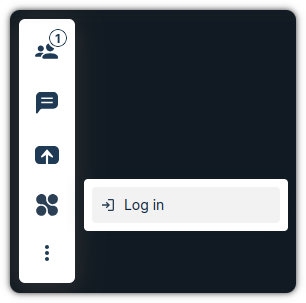
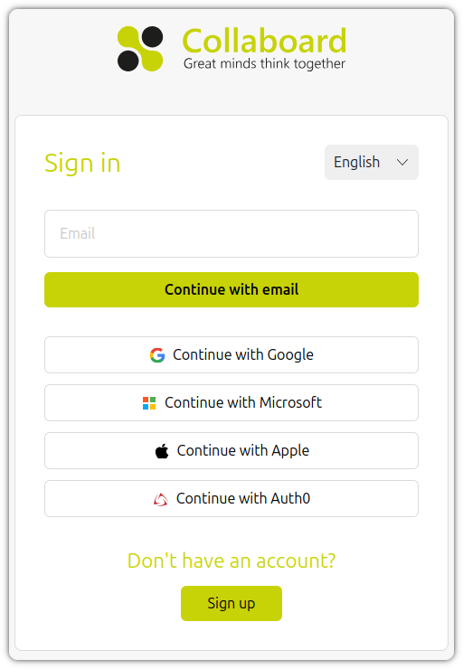
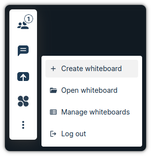
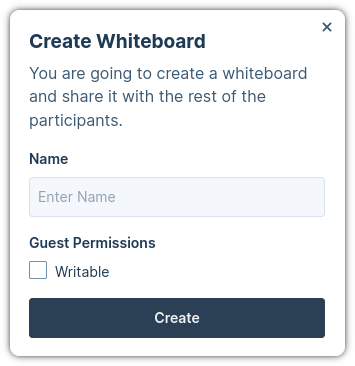
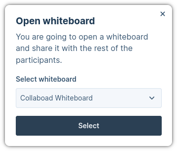
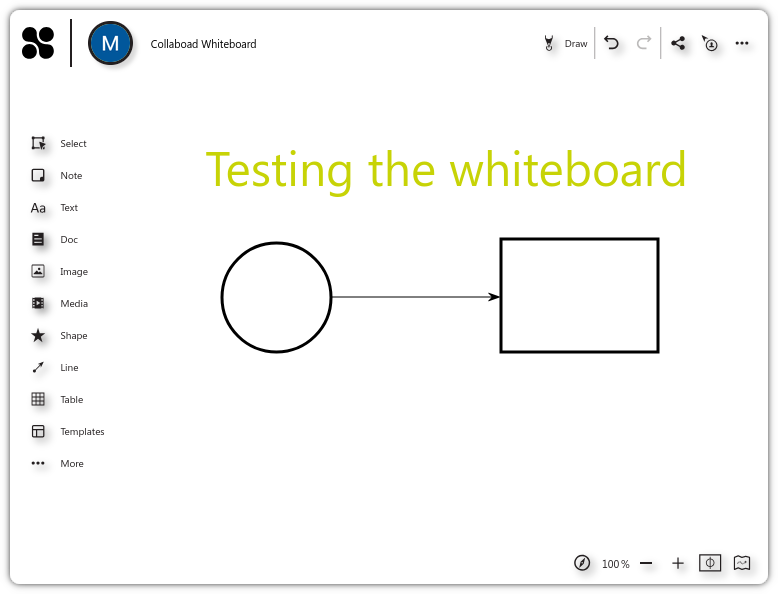

# Web App 3 Plugin: Collaboard

This plugin enables the user to share whiteboard during the meetings with the
rest of the participants.

## Requirements

In order to use this plugin, you need to comply with the following requirements:

| Component      | Version |
| -------------- | ------- |
| Pexip Infinity | v36     |

## How to use

This plugin will create a new button in the interface. That will allow us to
share a whiteboard with the rest of the participants.

Once you click on the button, the first thing you will see is a button to log
in:

<div align='center'>



</div>

After you click on log in, you will see a new pop up window with a panel to log
in with username/password and other social login options:

<div align='center'>



</div>

Once you log in, you will see new buttons in the interface:

<div align='center'>



</div>

We have two main options to share a whiteboard:

- **Create whiteboard**: This button will create a new whiteboard and share it
  with the rest of participants.

<div align='center'>



</div>

- **Open whiteboard**: This button will show a list of all available whiteboards
  and share the selected one with the rest of participants.

<div align='center'>



</div>

Once the user has created or open a whiteboard, the app will show a new window
with the whiteboard:

<div align='center'>



</div>

## How to configure the branding

This plugin uses `oAuth` authentication and, to support this, we need to enable
the redirections in the `manifest.json` file:

```json
{
  "applicationConfig": {
    "handleOauthRedirects": true
    ...
  }
  ...
}
```

### Configuration requirements starting from Infinity v37

The `id` of the plugin in the manifest should be `plugin-collaboard` to support
the new Widget concept.

In addition, because of the tightened security in v37,
`"sandboxValues": ["allow-same-origin", "allow-popups", "allow-popups-to-escape-sandbox"]`
needs to be added to the plugin config in the manifest.

More information about the above change can be found here:
https://developer.pexip.com/docs/infinity/web/plugins/webapp-3/sandbox-security

Your manifest will now look something like the following.

```
{
  ...
  "plugins": [
    {
    	"id": "plugin-collaboard",
    	"src": "...",
      "sandboxValues": [
        "allow-same-origin",
        "allow-popups",
        "allow-popups-to-escape-sandbox"
      ]
    }
  ]
}
```

## How to configure the plugin

This plugin uses the `config.json` file to store the configuration. You should
create the file in the `public` folder in your are developing or in the root of
folder of your plugin, if you are creating a package.

```json
{
  "apiUrl": "<collaboard-api-url>",
  "webappUrl": "<collaboard-webapp-url>",
  "clientId": "<client_id-provisioned>",
  "redirectUri": "<redirect-uri-after-login>"
}
```

## Run for development

- To be able to build the plugin, you need to comply with the following versions
  or higher:

  | NodeJS   | NPM     |
  | -------- | ------- |
  | v20.12.2 | v10.5.0 |

- Create a file `.env` in the root of the project with the following content:

```env
VITE_INFINITY_TARGET=<infinity_url>
VITE_DEV_SERVER_PORT=<dev_server_port>
```

The `VITE_INFINITY_TARGET` variable is **mandatory** and should contain the URL
of the Pexip Infinity system where you want to test the plugin.

The `VITE_DEV_SERVER_PORT` variable is an optional variable used to specify the
port on which the development server will run. If not provided, it defaults to
`5173`.

You can check an example in the provided `.env.example` file.

- Install all the dependencies:

```bash
$ npm i
```

- Run the dev environment:

```bash
$ npm start
```

The plugin will be served from https://localhost:5173 (visit that page and
accept the self-signed certificates), but you should access it thought the Web
App 3 URL. You have more information about how to configure your environment in
the
[Developer Portal: Setup guide for plugin developers](https://developer.pexip.com/docs/plugins/webapp-3/setup-guide-for-plugin-developers).

## Build for production

To create a package, you will need to first install all the dependencies:

```bash
$ npm i
```

And now to create the package itself:

```bash
$ npm run build
```

Congrats! Your package is ready and it will be available in the `dist` folder.
The next step is to create a Web App3 branding and copy `dist` into that
branding.

If you want to know more about how to deploy your plugin in Pexip Infinity,
check our [Developer Portal](https://developer.pexip.com).
